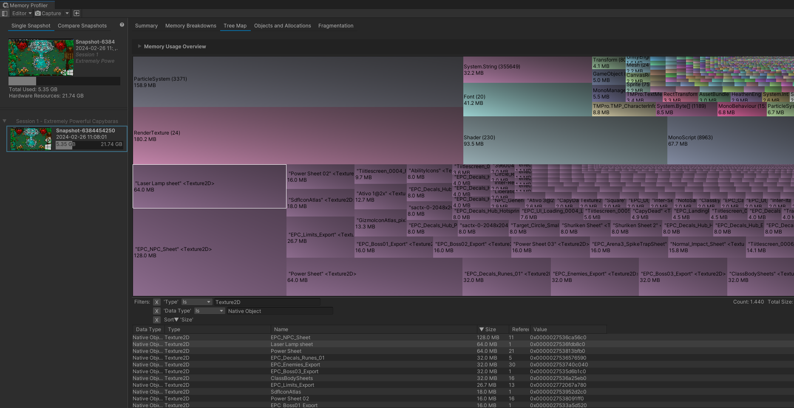

> Have you ever seen Capybaras this powerful before ?


    


## Technical Details

- Released on [Steam](https://store.steampowered.com/app/2089980/Extremely_Powerful_Capybaras/) in December 2023
- Coming Q1 2025 to Xbox Series X/S, PS4, PS5 & Nintendo Switch
- Developed in Unity
- Networking Library used: 



## Details & Responsibilities 

**Creative Director, Gameplay/Network Programmer**

Extremely Powerful Capybaras (EPC) remains the most challenging project in my career at the same time it is the project I'm most proud of, the dichotomy of game development I guess.
Around March 2022 before we released Sky Caravan we were in desperate need of a break from the project. We took some inspiration from Double Fine's *Amnesia Fortnight* and took some time to brainstorm some ideias and throw together a prototype. At the time Vampire Survivors was starting to become popular and we took the genre and tried to aplly our own twists to it.


> Never before seen footage of the first EPC prototype. We called the characters *little dudes*. The game was very different back then.

The most important twist payed dividends, local multiplayer. We created a demo for Steam Next Fest in October 2022 and it was a hit! Now with the titular Capybaras on display we were on the top of both *roguelike* and *mutiplayer* categories, reaching the Top 10 most played demos and was even one of the most played demos on all of Steam for a while.

Securing a publishing deal with [PM Studios](https://www.pm-studios.com/) and later with Logoi Games were significant milestones, and allowed us to greatly expand the reach and potential of the game, especially in China, where most of our player base stems from.

The biggest change on the project came right after: making EPC a online multiplayer game. At the time I was acting as both Creative Director and Gameplay Programmer but since the game's content was mostly done we decided that the transition was only possible if I switched to full time Gameplay/Network Programmer. It was the hardest challengue I've ever faced as it was an almost complete rewrite of every single system.

Besides synchronization another issue was looming over the horizon: performance. Adding networking capabilities also added an obvious overhead to the game. It was my primary task to ensure stable performance, particularly during demanding gameplay segments. I've delved into the darkest dungeons of the Unity Profiller, Frame Debugger and our own internal tools to try reaching the perfomance that we needed. Learned a LOT in the process and also helped the porting team along the way.


> Our internal tool to debug enemy count during a run.


    


> Our frame debugger snapshot before some of the major texture/sprite optimizations.

The last thing that I'm really proud of is our player feedback tool. When then player presses F8 they can leave a feedback that is sent to our server and we adjust the team focus to better reflect what ours players want out of the game. We also collect data for every single run-if the player agrees- compile them and display them in a easy to use user interface.


    


The game was released December 5th 2023, a stressful project with many challenges but we shipped it. It gaves me the opportunity to learn a lot about performance, networking and directing. It was awesome to work with a good publisher as well, I was fortunate enough to go to PAX East and West with the game, they both were absolutely great. Capybaras are indeed *extremely powerful*.


    


> From left to right: me, Aenne and Jas from Stumpt in PAX West 2023

## Giving back to the community

Together with [Yann Lemos](yannlemos.com) we created a *development console* to help us with testing and debbuging using the ImGui framework. A version of the console is available in the following repository:



## Steam Page 

<iframe src="https://store.steampowered.com/widget/2089980/" frameborder="0" width="646" height="190"></iframe>