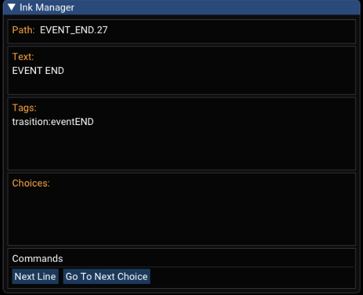
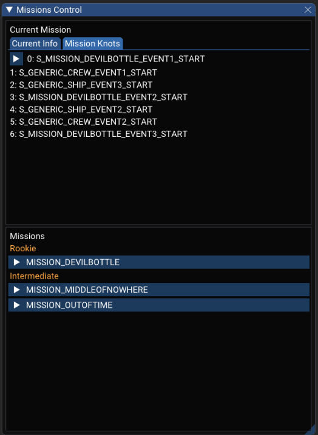

> You are the captain - and the clouds are waiting!


  
   
     
  


## Technical Details

- Released on [Steam](https://store.steampowered.com/app/1792270/Sky_Caravan/) in 2022
- Released on the [Nintendo Switch](https://www.nintendo.com/us/store/products/sky-caravan-switch/) in 2023 
- Developed in Unity and written in the [Ink](https://github.com/inkle/ink) scripting language
- Extensive use of the [ImGui](https://github.com/ocornut/imgui) framework for testing and debugging

## Details & Responsibilities

**Lead Programmer, Business Developer**

Sky Caravan was my first commercial title alongside [Studio Bravarda](https://studiobravarda.com/). We were coming from a canceled project, and it was really important for us as a studio and as individual developers to release something on Steam.

Having the full experience from start to finish was definitely worth it and taught me a few very important lessons that now accompany me in every project moving forward.

As the lead programmer, it was my responsibility to empower the game designers and writers to create/alter/test the game's content. I still think this is one of the most important aspects of a programmer in a game development context. 

It was the first time using the [ImGui](https://github.com/ocornut/imgui) framework in a professional capacity, and using it completely changed the way I develop features. It's now clear to me how every single feature must have a bloat-free testing GUI for the final user of the feature in question, be they programmers, designers, or artists. The game being written using the [Ink](https://github.com/inkle/ink) scripting language meant that there was no testing interface for it inside the engine that could do what we wanted it to do, so we implemented our own from scratch. 

Ink itself does have a GUI to test your story, but it was outside Unity and didn't cover everything that Sky Caravan needed. After we implemented it, the writers/designers/testers could jump to any point in the story, see the choices in plain text with all the meta-info, fast forward to the next choice, and see the value of every single backend gameplay variable in realtime.


  
   


> Ink Manager that helped writers and designers Ink content. | 
> The Missions Control allowed jumps around in the story/missions.

During the final stretch I felt something that was new to me: the last 10% of work actually matters to the player. While I was waiting for a QA round to end and I had a few hours with the project for myself, I implemented a few physics-simulated cables in the HUD using Verlet integration—something I've wanted to use for a while. In the grand scheme of things, it was just a flare, a tiny feature that didn't impact the gameplay and wasn't really necessary. The team loved it! They said that it increased immersion and the artists even did some particles to go along with it. Some players did notice it as well! This is the type of lesson you can only learn when you go above 90% of completion in a project and go for the final push to release it.



> Cables, cables everywhere!

I've also learned that the game you release might be very different from the game you've started developing. It's not a secret anymore—we've discussed it in podcasts and blog posts—but Sky Caravan started as a "narrative roguelite" and was later reworked to be a linear narrative. 

At the start we crafted numerous small story moments that were pieced together by a procedural system. It was very exciting to design a new system with a weighted randomized selection of story moments based on tags—*mystery, crew, action, location, etc*. We found out sooner rather than later that without a bespoken narrative thread gluing the story moments together, everything felt flat and uninspiring. So after a very brief moment of discussion where everyone agreed, we switched to a linear experience. The funny thing is that the roguelite backend system is still there, but it always draws the same story moments in the same order—this was cheaper than rewriting the entire sytem.

Post launch we even worked on a full Twitch integration to enable streamers to play alongside the chat. This feature wasn't in the original scope of the game, but launching it gave us some confidence that it should be done.



> Twitch integration that could be used by streamers.

Sky Caravan was a fantastic project! To this day we call it our post graduation course on game development. We learned a lot, shipped a complete game, launched it for the Switch and created a true Brazilian game that we are really proud of. Currently the game has 100% positive reviews on Steam, which brings me immense joy.

## Steam Page 

<iframe src="https://store.steampowered.com/widget/1792270/" frameborder="0" width="646" height="190"></iframe>